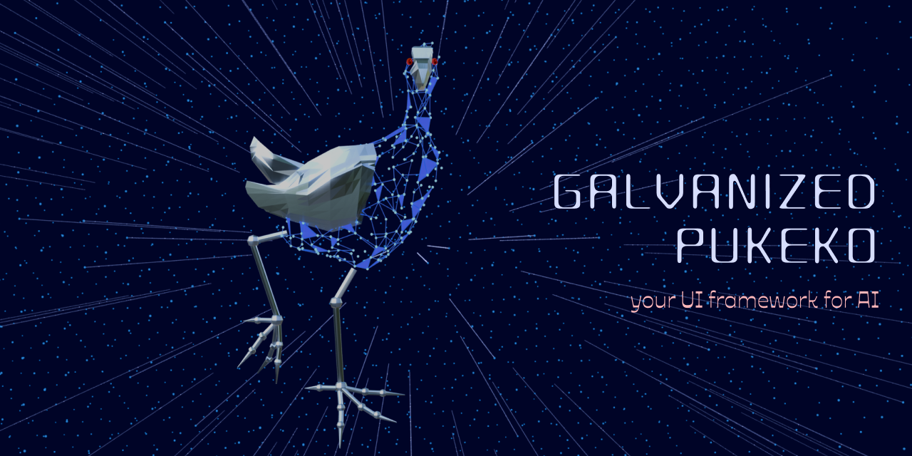
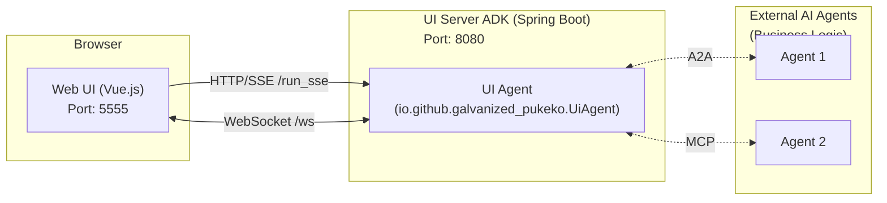

# Galvanized Pukeko

[](https://openjdk.org/)
[](https://nodejs.org/)
[](https://vuejs.org/)
[](https://github.com/google/adk-java)

Galvanized Pukeko is a framework that enables LLM-powered agents to dynamically render forms, charts, and tables when interacting with users. It eliminates the need for static HTML pages while maintaining consistent formatting and branded interfaces.

> Status: This is a proof-of-concept; expect frequent changes and occasional breakage while we iterate.



A quick demo on YouTube: https://youtu.be/rfiUhsaDtrU

## Features

- **Dynamic UI Rendering** - AI agents can render forms, charts, and tables on-the-fly
- **Real-time Communication** - WebSocket integration for instant form updates
- **Chat Interface** - Built-in conversational UI powered by SSE streaming
- **Extensible Architecture** - Support for MCP (Model Context Protocol) and A2A (Agent-to-Agent) integrations
- **Embedded Deployment** - Web client can be served directly from the agent server

## Monorepo Structure

This project is organized as a monorepo containing the following packages:

| Package | Description | Documentation |
|---------|-------------|---------------|
| [`galvanized-pukeko-agent-adk`](packages/galvanized-pukeko-agent-adk/) | Spring Boot application extending Google ADK with UI rendering capabilities. Available on [Maven Central](https://central.sonatype.com/artifact/io.github.galvanized-pukeko/galvanized-pukeko-agent-adk). | [README](packages/galvanized-pukeko-agent-adk/README.md) |
| [`galvanized-pukeko-web-client`](packages/galvanized-pukeko-web-client/) | Vue.js application providing chat interface and dynamic component renderer | [README](packages/galvanized-pukeko-web-client/README.md) |

## System Architecture

The system consists of a Web UI (Vue.js) and a UI Server ADK (Spring Boot) hosting the AI Agent.



### Components Overview

1. **[Web Client](packages/galvanized-pukeko-web-client/)** (`packages/galvanized-pukeko-web-client`):
   - Vue.js application providing chat interface and dynamic form renderer
   - Runs standalone on **port 5555** for development, or served from the ADK agent
   - Communicates via HTTP/SSE for chat and WebSockets for UI rendering

2. **[Agent ADK](packages/galvanized-pukeko-agent-adk/)** (`packages/galvanized-pukeko-agent-adk`):
   - Spring Boot application running on **port 8080**
   - Extends Google ADK to host `UiAgent` with dynamic UI rendering tools
   - Serves the built web client and exposes API endpoints
   - Supports MCP and A2A integrations for external tools and agents

## Getting Started

### Prerequisites

- Java 17+ (recommended: Temurin 21)
- Node.js 18+
- Maven (included via wrapper)

### Quick Start

#### Option 1: Standalone Agent (Recommended)

The Agent ADK includes a pre-built web client. Start the agent with:

```bash
cd packages/galvanized-pukeko-agent-adk
./mvnw clean compile exec:java -Dexec.classpathScope=compile \
  -Dexec.args="--server.port=8080 --adk.agents.source-dir=target"
```

Navigate to `http://localhost:8080` in your browser.

#### Option 2: Development Mode

For web client development with hot-reload:

```bash
./start-dev.sh
```

This starts:
1. **Agent ADK** on port 8080
2. **Web Client** dev server on port 5555

Navigate to `http://localhost:5555` for development.

### Manual Startup

**Start the Agent ADK:**

```bash
cd packages/galvanized-pukeko-agent-adk
./mvnw clean compile exec:java -Dexec.classpathScope=compile \
  -Dexec.args="--server.port=8080 --adk.agents.source-dir=target"
```

**Start the Web Client (development):**

```bash
cd packages/galvanized-pukeko-web-client
npm install
npm run dev
```

### Deploying Web Client to Agent

After making changes to the web client, deploy to the agent:

```bash
cd packages/galvanized-pukeko-web-client
./deploy-to-adk.sh
```

This builds the web client and copies artifacts to the agent's resources directory.

## Usage

1. Open `http://localhost:8080` (or `http://localhost:5555` in development mode)
2. Type "Hello" in the chat to verify connectivity
3. Try these commands to see dynamic UI rendering:
   - `"Show me a contact form"` - Renders a dynamic form
   - `"Show me a chart of month lengths"` - Displays a chart
   - `"Show me a table of suppliers"` - Renders a data table

## Testing

We use [Playwright](https://playwright.dev/) for End-to-End (E2E) testing.

### Running Tests

Ensure the application is running (see [Getting Started](#getting-started)), then:

```bash
npx playwright test
```

If Playwright reports the browser is not found, run `npx playwright install`.

### Test Options

```bash
# Interactive UI mode
npx playwright test --ui

# Headed mode (visible browser, sequential execution)
npx playwright test --headed --workers=1

# Debug mode
npx playwright test --debug
```

## Configuration

### Environment Variables

| Variable | Description | Default |
|----------|-------------|---------|
| `GOOGLE_API_KEY` or `GEMINI_API_KEY` | API key for Google AI / Gemini models | Required |
| `GOOGLE_GENAI_USE_VERTEXAI` | Set to `"true"` to use Vertex AI instead of Google AI | `false` |

> **Note on AI Providers:** Currently, the framework primarily supports Google Gemini models through Google AI or Vertex AI. We're working on adding support for other AI providers soon. In the meantime, Anthropic models available in the [Vertex AI Model Garden](https://cloud.google.com/vertex-ai/docs/start/explore-models) should work when using `GOOGLE_GENAI_USE_VERTEXAI="true"`.

### Application Properties

See [Agent ADK README](packages/galvanized-pukeko-agent-adk/README.md#configuration) for detailed configuration options including:
- UI customization (logo, header, footer)
- CORS settings
- MCP server integration
- A2A agent configuration

## Contributing

Contributions are welcome! Please feel free to submit issues and pull requests.

1. Fork the repository
2. Create your feature branch (`git checkout -b feature/amazing-feature`)
3. Commit your changes (`git commit -m 'Add amazing feature'`)
4. Push to the branch (`git push origin feature/amazing-feature`)
5. Open a Pull Request

## Related Resources

- [Google ADK (Agent Development Kit)](https://github.com/google/adk-java)
- [Model Context Protocol (MCP)](https://modelcontextprotocol.io/)
- [Vue.js Documentation](https://vuejs.org/)
