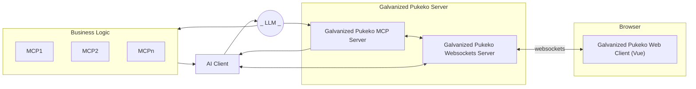

# Galvanized Pukeko

Galvanized Pukeko UI is a framework that allows LLM models (AI) to flexibly render forms and components when
getting information from users. It eliminates the need to render entire HTML pages while maintaining consistent
formatting and coherent branded interfaces.


The project is at a very early prototyping stage, so it is not very helpful yet.



# Running a quick demo

```bash
git clone https://github.com/Galvanized-Pukeko/galvanized-pukeko-ai-ui.git
cd galvanized-pukeko-ai-ui
npm install
npm run 
```

Http UI MCP
```bash
npm run ui-mcp-server
```

Web (just to serve the Web)
```bash
npm run web
```

Start mock data MCP
```bash
npm run demo-data-mcp-server
```

Start chat client in terminal (http)
```bash
npm run chat
```

Chat is preconfigured with `vertexai`, so you need to authenticate.

Config is in `packages/ui-mcp-server-js/.gsloth.config.mjs`, so different AI provider can be chosen.

---

When everything is up:

Ask chat to `list reports`

Then ask to `render bar chart of performance`

---

There's also STDIO for the UI server
```bash
npm run ui-mcp-server-stdio
```

STDIO needs to be configured, but I did not test it, so it's likely not working.


## Development

Kitchen Sink is a static collection of all components (for component inspection)
```bash
npm run sink
```

## Contributing

Contributions are welcome. Feel free to create an issue to contact us.
