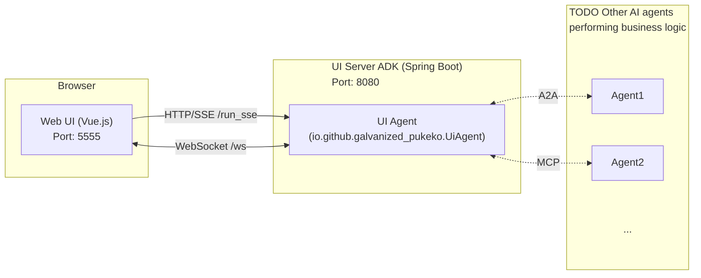

# Galvanized Pukeko

Galvanized Pukeko UI is a framework that allows LLM models (AI) to flexibly render forms and
components when getting information from users. It eliminates the need to render entire HTML pages
while maintaining consistent formatting and coherent branded interfaces.


## System Architecture

The system consists of a Web UI (Vue.js) and a UI Server ADK (Spring Boot) hosting the AI Agent.



### Components

1. **Web UI (`packages/web`)**:
    - A Vue.js application running on **port 5555**.
    - Provides a chat interface and a dynamic form renderer.
    - Connects to the Agent via HTTP/SSE for chat messages and WebSockets for form rendering.

2. **UI Server ADK (`packages/ui-server-adk`)**:
    - A Spring Boot application running on **port 8080**.
    - Hosts the `UiAgent` which handles user interactions and triggers form rendering.
    - Exposes endpoints for SSE (`/run_sse`) and WebSockets (`/ws`).

## Getting Started

### Prerequisites

- Java 17+
- Node.js 18+
- Maven

### Quick Start

We provide a convenience script to start both the UI Server ADK and the Web UI in parallel.

```bash
./start-all.sh
```

This will:

1. Start the **UI Server ADK** on port 8080.
2. Start the **Web UI** on port 5555.

Once started, navigate to `http://localhost:5555` in your browser.

### Manual Startup

If you prefer to start the services individually:

**1. Start the UI Server ADK:**

```bash
cd packages/ui-server-adk
mvn clean compile exec:java -Dexec.classpathScope=compile -Dexec.args="--server.port=8080 --adk.agents.source-dir=target"
```

**2. Start the Web UI:**

```bash
cd packages/web
npm run dev
```

## Usage

1. Open `http://localhost:5555`.
2. Type "Hello" in the chat to verify connectivity.
3. Type "Show me a contact form" to see the dynamic form rendering in action.

## Testing

We use [Playwright](https://playwright.dev/) for End-to-End (E2E) testing.

### Running Tests

To run the tests, ensure the application is running (see [Getting Started](#getting-started)), then run:

```bash
npx playwright test
```

### Running Tests with UI

To run the tests in interactive UI mode:

```bash
npx playwright test --ui
```

### Debugging Tests

To run tests in debug mode:

```bash
npx playwright test --debug
```

## Contributing

Contributions are welcome. Feel free to create an issue to contact us.