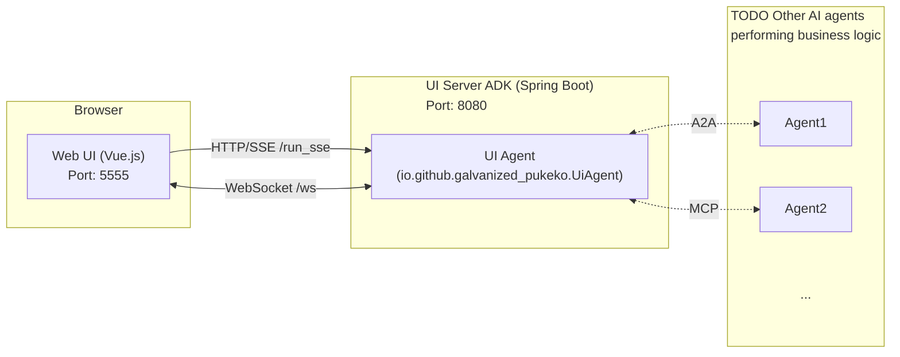

# Galvanized Pukeko

Galvanized Pukeko UI is a framework that allows LLM models (AI) to flexibly render forms and
components when getting information from users. It eliminates the need to render entire HTML pages
while maintaining consistent formatting and coherent branded interfaces.


## System Architecture

The system consists of a Web UI (Vue.js) and a UI Server ADK (Spring Boot) hosting the AI Agent.



### Components

1. **[Web Client](packages/galvanized-pukeko-web-client/)** (`packages/galvanized-pukeko-web-client`):
    - A Vue.js application that provides a chat interface and dynamic form renderer.
    - Can run standalone on **port 5555** for development, or be served from the ADK agent.
    - Connects to the Agent via HTTP/SSE for chat messages and WebSockets for form rendering.

2. **[Agent ADK](packages/galvanized-pukeko-agent-adk/)** (`packages/galvanized-pukeko-agent-adk`):
    - A Spring Boot application running on **port 8080**.
    - Extends Google ADK to host the `UiAgent` with dynamic UI rendering capabilities.
    - Serves the built web client from `/` and exposes API endpoints.
    - Supports optional MCP (Model Context Protocol) integration for external tools.

## Getting Started

### Prerequisites

- Java 17+
- Node.js 18+
- Maven

### Quick Start

#### Option 1: Standalone Agent (Recommended)

The Agent ADK includes a built-in web client. Simply start the agent:

```bash
cd packages/galvanized-pukeko-agent-adk
mvn clean compile exec:java -Dexec.classpathScope=compile -Dexec.args="--server.port=8080 --adk.agents.source-dir=target"
```

Then navigate to `http://localhost:8080` in your browser.

#### Option 2: Development Mode

For web client development, run both services separately:

```bash
./start-all.sh
```

This will:
1. Start the **Agent ADK** on port 8080
2. Start the **Web Client** dev server on port 5555

Navigate to `http://localhost:5555` for hot-reload development.

### Manual Startup

**Start the Agent ADK:**

```bash
cd packages/galvanized-pukeko-agent-adk
mvn clean compile exec:java -Dexec.classpathScope=compile -Dexec.args="--server.port=8080 --adk.agents.source-dir=target"
```

**Start the Web Client (development only):**

```bash
cd packages/galvanized-pukeko-web-client
npm install
npm run dev
```

### Deploying Web Client to Agent

After making changes to the web client, deploy it to the agent:

```bash
cd packages/galvanized-pukeko-web-client
./deploy-to-adk.sh
```

This builds the web client and copies it to the agent's resources directory.

## Usage

1. Open `http://localhost:8080` (or `http://localhost:5555` in development mode).
2. Type "Hello" in the chat to verify connectivity.
3. Try these commands to see dynamic UI rendering:
   - "Show me a contact form" - Renders a dynamic form
   - "Show me a chart of month lengths" - Displays a chart
   - "Show me a table of suppliers" - Renders a data table

## Testing

We use [Playwright](https://playwright.dev/) for End-to-End (E2E) testing.

### Running Tests

To run the tests, ensure the application is running (see [Getting Started](#getting-started)), then run:

```bash
npx playwright test
```

If playwright complaints that browser is not found, run `npx playwright install` to download the browser.

### Running Tests with UI

To run the tests in interactive UI mode:

```bash
npx playwright test --ui
```

### Running Tests in Headed Sequential Mode

To run tests visibly (headed) and one by one (sequential), which is useful for debugging or demonstrations:

```bash
npx playwright test --headed --workers=1
```

### Debugging Tests

To run tests in debug mode:

```bash
npx playwright test --debug
```

## Contributing

Contributions are welcome. Feel free to create an issue to contact us.