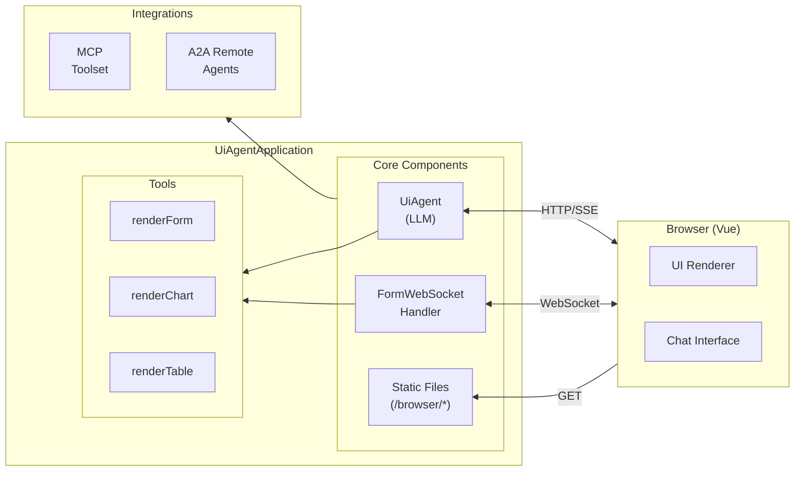

# Galvanized Pukeko Agent ADK

[](https://central.sonatype.com/artifact/io.github.galvanized-pukeko/galvanized-pukeko-agent-adk)

A Spring Boot application that extends the [Google ADK (Agent Development Kit)](https://github.com/google/adk-java) to provide a UI-enabled agent with dynamic form, chart, and table rendering capabilities.

> **Part of the [Galvanized Pukeko](../../README.md) monorepo** - See the root README for project overview and getting started guide.

## Features

- **Dynamic UI Rendering** - Render forms, charts, and tables dynamically through agent tools
- **WebSocket Integration** - Real-time bidirectional communication for UI updates
- **SSE Streaming** - Server-sent events for chat message streaming
- **MCP Support** - Optional integration with Model Context Protocol servers for external tools
- **A2A Support** - Agent-to-Agent communication for delegating tasks to specialized agents
- **Embedded Web Client** - Serves the Vue.js web client from the same server

## Architecture

This application extends `AdkWebServer` from the Google ADK framework and provides:



### Core Components

| Component | Description |
|-----------|-------------|
| `UiAgentApplication` | Main entry point, extends AdkWebServer |
| `UiAgent` | LLM-powered agent with UI rendering tools |
| `FormWebSocketHandler` | WebSocket handler for real-time UI communication |
| `McpToolsetFactory` | Optional MCP toolset integration |
| `A2aAgentFactory` | Optional A2A remote agent integration |

## Installation

Add the dependency to your `pom.xml`:

```xml
<dependency>
  <groupId>io.github.galvanized-pukeko</groupId>
  <artifactId>galvanized-pukeko-agent-adk</artifactId>
  <version>0.0.1</version>
</dependency>
```

Or for Gradle (`build.gradle`):

```groovy
implementation 'io.github.galvanized-pukeko:galvanized-pukeko-agent-adk:0.0.1'
```

## Getting Started

### Prerequisites

- Java 17+ (recommended: Temurin 21)
- `GOOGLE_API_KEY` or `GEMINI_API_KEY` environment variable set

> **Note on AI Providers:** Currently, the agent primarily supports Google Gemini models. Set `GOOGLE_GENAI_USE_VERTEXAI="true"` to use Vertex AI instead of Google AI. We're working on adding support for other AI providers soon. Anthropic models available in the [Vertex AI Model Garden](https://cloud.google.com/vertex-ai/docs/start/explore-models) should work with the Vertex AI flag enabled.

### Running the Server

```bash
./mvnw clean compile exec:java -Dexec.classpathScope=compile \
  -Dexec.args="--server.port=8080 --adk.agents.source-dir=target"
```

The server will start on port 8080 and serve:
- Web UI at `http://localhost:8080/`
- Agent API endpoints at `/apps/pukeko-ui-agent/`
- WebSocket endpoint at `/ws`
- Configuration endpoint at `/api/ui-config`

## Configuration

Configuration is managed through `src/main/resources/application.properties`.

### AI Model Configuration

Configure the LLM model used by the agent:

```properties
# Model to use for the UI Agent (default: gemini-2.5-pro)
pukeko.ai.model=gemini-2.5-pro
```

Available models depend on your configuration:
- **Google AI**: `gemini-2.5-pro`, `gemini-2.5-flash`, `gemini-2.0-flash`, etc.
- **Vertex AI** (with `GOOGLE_GENAI_USE_VERTEXAI=true`): Gemini models and Anthropic models from the Model Garden

### UI Configuration

Customize the web client appearance:

```properties
# Base URLs (auto-detected if not set)
pukeko.ui.base-url=http://localhost:${PORT:8080}
pukeko.ui.ws-url=ws://localhost:${PORT:8080}/ws
pukeko.ui.app-name=pukeko-ui-agent

# Browser page title (default: Galvanized Pukeko)
pukeko.ui.page-title=My Application

# Logo configuration
pukeko.ui.logo.text=My App
pukeko.ui.logo.href=https://example.com
pukeko.ui.logo.img=https://example.com/logo.png

# Header navigation items
pukeko.ui.header[0].text=Docs
pukeko.ui.header[0].href=https://example.com/docs
pukeko.ui.header[1].text=GitHub
pukeko.ui.header[1].href=https://github.com/example

# Footer items
pukeko.ui.footer[0].text=© 2025 My Company
pukeko.ui.footer[0].href=https://example.com
```

### CORS Configuration

```properties
adk.web.cors.origins=http://localhost:5555,https://localhost:5555
adk.web.cors.methods=GET,POST,PUT,DELETE,OPTIONS
adk.web.cors.headers=*
adk.web.cors.allow-credentials=true
```

### MCP (Model Context Protocol) Configuration

Connect to external MCP tool servers:

```properties
# Enable MCP integration
mcp.enabled=true

# HTTP/SSE transport
mcp.url=http://localhost:8081
```

For stdio transport (e.g., running a local MCP server):

```properties
mcp.url=stdio://npx
mcp.command=npx
mcp.args=-y,@modelcontextprotocol/server-everything
```

### A2A (Agent-to-Agent) Configuration

Connect to remote agents:

```properties
a2a.enabled=true
a2a.url=http://localhost:9000
a2a.name=remote-specialist-agent
```

## API Reference

### Creating a Session

```bash
curl 'http://localhost:8080/apps/pukeko-ui-agent/users/user/sessions' \
  -X POST \
  -H "Content-Type: application/json" \
  -H 'Accept: application/json'
```

Response:
```json
{
  "id": "0c6cbd90-c832-43bc-accd-f47bf78d1cf7",
  "appName": "pukeko-ui-agent",
  "userId": "user",
  "state": {},
  "events": [],
  "lastUpdateTime": 1763716899419022
}
```

### Sending a Chat Message

```bash
curl 'http://localhost:8080/run_sse' \
  -H 'Accept: text/event-stream' \
  -H 'Content-Type: application/json' \
  --data-raw '{
    "appName": "pukeko-ui-agent",
    "userId": "user",
    "sessionId": "<session-id>",
    "newMessage": {
      "role": "user",
      "parts": [{"text": "Show me a contact form"}]
    },
    "streaming": false
  }'
```

### Getting UI Configuration

```bash
curl 'http://localhost:8080/api/ui-config' \
  -H 'Accept: application/json'
```

## Agent Tools

The UI Agent provides three rendering tools that communicate with the web client via WebSocket:

### renderForm

Display interactive forms to collect user input.

```json
{
  "components": [
    {"type": "input", "label": "Name", "value": ""},
    {"type": "input", "label": "Email", "value": ""},
    {"type": "select", "label": "Country", "options": ["USA", "UK", "Canada"]},
    {"type": "checkbox", "label": "Subscribe to newsletter"}
  ],
  "submitLabel": "Submit",
  "cancelLabel": "Cancel"
}
```

### renderChart

Display data visualizations.

```json
{
  "chartType": "bar",
  "title": "Monthly Sales",
  "data": {
    "labels": ["Jan", "Feb", "Mar"],
    "datasets": [{
      "label": "Sales",
      "data": [100, 150, 200]
    }]
  }
}
```

Supported chart types: `bar`, `pie`

### renderTable

Display tabular data.

```json
{
  "caption": "Employee Directory",
  "header": ["Name", "Department", "Role"],
  "data": [
    ["Alice", "Engineering", "Developer"],
    ["Bob", "Design", "Designer"]
  ],
  "footer": ["Total", "", "2 employees"]
}
```

## Web Client Integration

The application serves a built Vue.js web client from `src/main/resources/browser/`.

To update the web client after making changes:

```bash
cd ../galvanized-pukeko-web-client
./deploy-to-adk.sh
```

This builds the web client and copies artifacts to this package's resources directory.

## Development

### Stopping the Server

Kill a running server process:

```bash
lsof -ti:8080 | xargs kill -9 2>/dev/null || true
```

### Project Structure

```
src/main/
├── java/io/github/galvanized_pukeko/
│   ├── UiAgentApplication.java    # Main entry point
│   ├── UiAgent.java               # Agent with UI tools
│   ├── FormWebSocketHandler.java  # WebSocket handler
│   ├── FormWebSocketConfigurer.java
│   ├── config/
│   │   ├── McpConfiguration.java
│   │   ├── McpToolsetFactory.java
│   │   ├── A2aConfiguration.java
│   │   ├── A2aAgentFactory.java
│   │   └── UiConfigProperties.java
│   └── web/
│       └── UiConfigController.java
└── resources/
    ├── application.properties
    └── browser/                   # Built web client
```

## Deploying to Google Cloud Run

The UI agent can be deployed to Google Cloud Run:

```bash
# Set your GCP project
export TEST_AGENT_GCP_PROJECT=your-gcp-project-id
# Set the host (no protocol) for the UI and CORS configuration (Cloud Run URL or custom domain)
export TEST_AGENT_HOST=test-agent-service-xyz-ue.a.run.app

# Deploy
./deploy.sh
```

Prerequisites:
- Google Cloud CLI (`gcloud`) installed and authenticated
- A GCP project with Cloud Run and Vertex AI APIs enabled

The deployment script uses Vertex AI for model access, which supports both Gemini and Anthropic models from the Model Garden.

**Note:** When deploying to Cloud Run, ensure your MCP server is also accessible from the cloud environment, or update `application.properties` to point to a cloud-hosted MCP server.

The deployment script uses Vertex AI for model access, which supports both Gemini and Anthropic models from the Model Garden.

You need to configure your URLs and CORS for your deployment. The `deploy.sh` script sets `WEB_HOST=$TEST_AGENT_HOST`, which is used to derive the UI base URL, WebSocket URL, and CORS origins.
```
pukeko.ui.base-url=https://your-domain.com
pukeko.ui.ws-url=wss://your-domain.com/ws
adk.web.cors.origins=https://your-domain.com,wss://your-domain.com
adk.web.cors.methods=GET,POST,PUT,DELETE,OPTIONS
adk.web.cors.headers=*
adk.web.cors.allow-credentials=true
adk.web.cors.max-age=3600
adk.web.cors.mapping=/**
```

Important! The websockets need 1G of memory, configure your instance size to have 1G of memory; default 512 is not enough.

## Examples

See the [examples](../../examples/) directory for complete working examples:

- [ADK UI Agent to ADK Agent](../../examples/adk-ui-agent-to-adk-agent/) - UI agent communicating with another ADK agent via A2A
- [ADK UI Agent to External MCP](../../examples/adk-ui-agent-to-external-mcp/) - UI agent connecting to external MCP servers

## Related Documentation

- [Root README](../../README.md) - Project overview and monorepo structure
- [Web Client](../galvanized-pukeko-web-client/README.md) - Vue.js web client documentation
- [Google ADK Documentation](https://github.com/google/adk-java)
